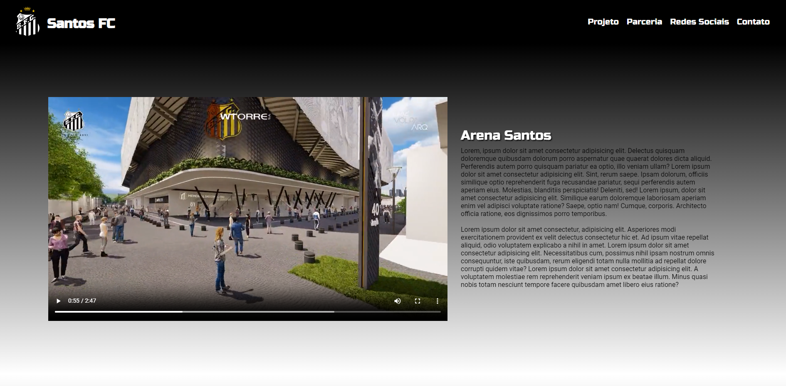

<h1 align="center">
  Arena Santos
</h1>

## 📷 Deploy

<h3>LINK: https://arena-santos.vercel.app/</h3>

## 💻 Projeto

Projeto próprio, onde consegui aplicar os conceitos de HTML e CSS para a criação de uma Landing Page, utilizado como projeto de conclusão de módulo na EBAC - Escola Britânica de Artes Criativas e Tecnologia.

## 🚀 Tecnologias

- HTML
- CSS

## 📝 Aprendizados

- [x] Incorporar itens com HTML
- [x] Uso de imagens e vídeos com HTML
- [x] Uso de forms com HTML
- [x] Uso do CSS para estilização da página
